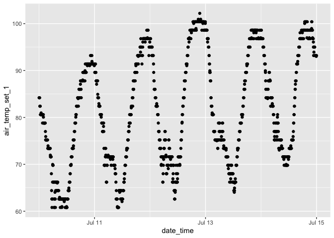

<!-- README.md is generated from README.Rmd. Please edit that file -->

# synopticr

<!-- badges: start -->

[](https://github.com/andypicke/synopticr/actions/workflows/R-CMD-check.yaml)
[](https://lifecycle.r-lib.org/articles/stages.html#experimental)

<!-- badges: end -->

The goal of {synopticr} is to make it easy to retrieve weather data from
the [Synoptic Data](https://synopticdata.com/) [weather
API](https://synopticdata.com/weatherapi/) via R.

## Installation

You can install the development version of {synopticr} from
[GitHub](https://github.com/) with:

``` r
# install.packages("devtools")
devtools::install_github("andypicke/synopticr")
```

## Authentication

You will need to [sign up for an api
token](https://signin.synopticdata.com/u/signup/) before using the api.
Synoptic offers free
[open-access](https://synopticdata.com/pricing/open-access-pricing/) for
non-commercial users. The functions in {synopticr} assume by default
that your token is stored in your *.Renviron* file as
SYNOPTIC_API_KEY=“you_key_here”. You can also pass in your api token
explicitly if wanted.

<div class="callout-note">

To store your api key, I find the easiest way is to use the
*edit_r_environ()* function from the {usethis} package.

</div>

# Examples

### Get networks

The *get_networks()* function returns a dataframe of all the weather
station networks available through the Synoptic api.

``` r

library(synopticr)

networks <- get_networks()

str(networks)
#> 'data.frame':    345 obs. of  15 variables:
#>  $ ID                : chr  "1" "2" "3" "4" ...
#>  $ SHORTNAME         : chr  "ASOS/AWOS" "RAWS" "DUGWAY" "UTAH DOT" ...
#>  $ LONGNAME          : chr  "ASOS/AWOS" "Interagency Remote Automatic Weather Stations" "U.S. Army Dugway Proving Grounds" "Utah Department of Transportation" ...
#>  $ URL               : chr  NA NA NA NA ...
#>  $ CATEGORY          : chr  "4" "9" "4" "10" ...
#>  $ LAST_OBSERVATION  : chr  "2024-07-31T21:35:00Z" "2024-07-31T21:05:00Z" "2024-07-31T21:05:00Z" "2024-07-31T21:00:00Z" ...
#>  $ REPORTING_STATIONS: int  2550 2442 29 191 34 29 6 21 22 26 ...
#>  $ ACTIVE_STATIONS   : int  2629 2508 30 195 34 39 6 22 22 26 ...
#>  $ TOTAL_STATIONS    : int  3549 3595 32 236 38 68 43 65 57 49 ...
#>  $ PERCENT_ACTIVE    : num  74.1 69.8 93.8 82.6 89.5 ...
#>  $ PERCENT_REPORTING : num  97 97.4 96.7 98 100 ...
#>  $ PERIOD_CHECKED    : int  120 90 30 60 60 120 120 90 120 60 ...
#>  $ ACTIVE_RESTRICTED : int  0 0 0 0 0 0 0 0 0 0 ...
#>  $ TOTAL_RESTRICTED  : int  0 0 0 0 0 0 0 0 0 0 ...
#>  $ PERIOD_OF_RECORD  :'data.frame':  345 obs. of  2 variables:
#>   ..$ start: chr  "1997-01-01T00:00:00Z" "1997-01-01T00:00:00Z" "1997-02-28T00:00:00Z" "1997-01-01T00:00:00Z" ...
#>   ..$ end  : chr  "2024-07-31T21:35:00Z" "2024-07-31T21:05:00Z" "2024-07-31T21:05:00Z" "2024-07-31T21:00:00Z" ...
```

### Get station metadata

The *get_metadata()* function will return a dataframe of stations and
their metadata for a specified state.

- Note the *STID* for each station can be used in other functions to
  request data for a specific station.

``` r


meta <- get_metadata(wh_state = "MA")

#head(meta)
str(meta)
#> 'data.frame':    875 obs. of  14 variables:
#>  $ ID              : chr  "4168" "4244" "4308" "4340" ...
#>  $ STID            : chr  "K2B6" "KACK" "KAQW" "KAYE" ...
#>  $ NAME            : chr  "NORTH ADAMS" "Nantucket, Nantucket Memorial Airport" "North Adams Harriman-and-West Airport" "Fort Devens / Ayer" ...
#>  $ ELEVATION       : chr  "659.0" "46.0" "640.0" "269.0" ...
#>  $ LATITUDE        : chr  "42.7" "41.25389" "42.69731" "42.56667" ...
#>  $ LONGITUDE       : chr  "-73.17" "-70.05972" "-73.16955" "-71.6" ...
#>  $ STATUS          : chr  "INACTIVE" "ACTIVE" "ACTIVE" "INACTIVE" ...
#>  $ MNET_ID         : chr  "1" "1" "1" "1" ...
#>  $ STATE           : chr  "MA" "MA" "MA" "MA" ...
#>  $ TIMEZONE        : chr  "America/New_York" "America/New_York" "America/New_York" "America/New_York" ...
#>  $ ELEV_DEM        : chr  "639.8" "39.4" "646.3" "265.7" ...
#>  $ PERIOD_OF_RECORD:'data.frame':    875 obs. of  2 variables:
#>   ..$ start: chr  NA "2002-08-14T00:00:00Z" "2002-08-14T00:00:00Z" NA ...
#>   ..$ end  : chr  NA "2024-07-31T20:30:00Z" "2024-07-31T20:35:00Z" NA ...
#>  $ UNITS           :'data.frame':    875 obs. of  2 variables:
#>   ..$ position : chr  "m" "m" "m" "m" ...
#>   ..$ elevation: chr  "ft" "ft" "ft" "ft" ...
#>  $ RESTRICTED      : logi  FALSE FALSE FALSE FALSE FALSE FALSE ...
```

### Get latest data *In Progress*

*get_latest_data()* returns the latest available data for stations in 1
state.

- Each row in the returned dataframe corresponds to a single station.

- *I am currently working on improving this function to clean up the
  variable names and add more options (requesting data for single
  stations etc.)*

``` r

library(dplyr)
#> 
#> Attaching package: 'dplyr'
#> The following objects are masked from 'package:stats':
#> 
#>     filter, lag
#> The following objects are masked from 'package:base':
#> 
#>     intersect, setdiff, setequal, union

# get latest data one station
df <- get_latest_data(wh_station = "KDEN")


# get latest data for all stations in a state
df <- get_latest_data(wh_state = "MA")

str(df)
#> tibble [447 × 172] (S3: tbl_df/tbl/data.frame)
#>  $ ID                                                 : chr [1:447] "4244" "4308" "4345" "4358" ...
#>  $ STID                                               : chr [1:447] "KACK" "KAQW" "KBAF" "KBED" ...
#>  $ NAME                                               : chr [1:447] "Nantucket, Nantucket Memorial Airport" "North Adams Harriman-and-West Airport" "Westfield, Barnes Municipal Airport" "Laurence G Hanscom Field Airport" ...
#>  $ ELEVATION                                          : chr [1:447] "46.0" "640.0" "269.0" "132.0" ...
#>  $ LATITUDE                                           : chr [1:447] "41.25389" "42.69731" "42.15972" "42.46811" ...
#>  $ LONGITUDE                                          : chr [1:447] "-70.05972" "-73.16955" "-72.71278" "-71.29463" ...
#>  $ STATUS                                             : chr [1:447] "ACTIVE" "ACTIVE" "ACTIVE" "ACTIVE" ...
#>  $ MNET_ID                                            : chr [1:447] "1" "1" "1" "1" ...
#>  $ STATE                                              : chr [1:447] "MA" "MA" "MA" "MA" ...
#>  $ TIMEZONE                                           : chr [1:447] "America/New_York" "America/New_York" "America/New_York" "America/New_York" ...
#>  $ ELEV_DEM                                           : chr [1:447] "39.4" "646.3" "272.3" "131.2" ...
#>  $ PERIOD_OF_RECORD                                   :'data.frame': 447 obs. of  2 variables:
#>   ..$ start: chr [1:447] "2002-08-14T00:00:00Z" "2002-08-14T00:00:00Z" "2002-08-14T00:00:00Z" "2002-08-14T00:00:00Z" ...
#>   ..$ end  : chr [1:447] "2024-07-31T20:30:00Z" "2024-07-31T20:35:00Z" "2024-07-31T20:30:00Z" "2024-07-31T20:30:00Z" ...
#>  $ UNITS                                              :'data.frame': 447 obs. of  2 variables:
#>   ..$ position : chr [1:447] "m" "m" "m" "m" ...
#>   ..$ elevation: chr [1:447] "ft" "ft" "ft" "ft" ...
#>  $ altimeter_value_1_value                            : num [1:447] 101388 101050 101050 101050 101118 ...
#>  $ altimeter_value_1_date_time                        : chr [1:447] "2024-07-31T21:05:00Z" "2024-07-31T21:00:00Z" "2024-07-31T21:05:00Z" "2024-07-31T21:05:00Z" ...
#>  $ air_temp_value_1_value                             : num [1:447] 23 26 24 28 26 27 29 24 27 29 ...
#>  $ air_temp_value_1_date_time                         : POSIXct[1:447], format: "2024-07-31 21:05:00" "2024-07-31 21:00:00" ...
#>  $ relative_humidity_value_1_value                    : num [1:447] 88.5 83.6 88.6 70 78.7 ...
#>  $ relative_humidity_value_1_date_time                : chr [1:447] "2024-07-31T21:05:00Z" "2024-07-31T21:00:00Z" "2024-07-31T21:05:00Z" "2024-07-31T21:05:00Z" ...
#>  $ wind_speed_value_1_value                           : num [1:447] 6.69 0 5.14 6.17 7.2 ...
#>  $ wind_speed_value_1_date_time                       : chr [1:447] "2024-07-31T21:05:00Z" "2024-07-31T21:00:00Z" "2024-07-31T21:05:00Z" "2024-07-31T21:05:00Z" ...
#>  $ wind_direction_value_1_value                       : num [1:447] 160 0 210 170 200 180 200 160 200 180 ...
#>  $ wind_direction_value_1_date_time                   : chr [1:447] "2024-07-31T21:05:00Z" "2024-07-31T21:00:00Z" "2024-07-31T21:05:00Z" "2024-07-31T21:05:00Z" ...
#>  $ wind_gust_value_1_value                            : num [1:447] 8.75 8.23 12.86 8.75 10.8 ...
#>  $ wind_gust_value_1_date_time                        : chr [1:447] "2024-07-31T20:10:00Z" "2024-07-31T19:55:00Z" "2024-07-31T20:53:00Z" "2024-07-31T21:00:00Z" ...
#>  $ sea_level_pressure_value_1_value                   : num [1:447] 101390 101000 100980 101140 101100 ...
#>  $ sea_level_pressure_value_1_date_time               : chr [1:447] "2024-07-31T20:53:00Z" "2024-07-31T20:52:00Z" "2024-07-31T20:53:00Z" "2024-07-31T20:51:00Z" ...
#>  $ weather_cond_code_value_1_value                    : num [1:447] 31 13 13 13 13 13 5 31 13 13 ...
#>  $ weather_cond_code_value_1_date_time                : chr [1:447] "2024-07-31T21:05:00Z" "2024-07-31T20:30:00Z" "2024-07-31T21:05:00Z" "2024-07-31T17:40:00Z" ...
#>  $ cloud_layer_3_code_value_1_value                   : num [1:447] 853 853 554 603 553 ...
#>  $ cloud_layer_3_code_value_1_date_time               : chr [1:447] "2024-07-31T11:05:00Z" "2024-07-31T21:00:00Z" "2024-07-31T21:05:00Z" "2024-07-31T20:55:00Z" ...
#>  $ pressure_tendency_value_1_value                    : num [1:447] 8009 6003 6004 6010 8011 ...
#>  $ pressure_tendency_value_1_date_time                : chr [1:447] "2024-07-31T20:53:00Z" "2024-07-31T20:52:00Z" "2024-07-31T20:53:00Z" "2024-07-31T20:51:00Z" ...
#>  $ precip_accum_one_hour_value_1_value                : num [1:447] 0.0254 0.508 0.254 0.0254 0.0254 0.254 0.0254 2.54 0.0254 0.508 ...
#>  $ precip_accum_one_hour_value_1_date_time            : chr [1:447] "2024-07-31T10:53:00Z" "2024-07-31T20:52:00Z" "2024-07-31T21:05:00Z" "2024-07-31T17:51:00Z" ...
#>  $ precip_accum_three_hour_value_1_value              : num [1:447] 0.0254 1.016 6.096 0.762 0.0254 ...
#>  $ precip_accum_three_hour_value_1_date_time          : chr [1:447] "2024-07-31T08:53:00Z" "2024-07-31T20:52:00Z" "2024-07-31T20:53:00Z" "2024-07-29T20:51:00Z" ...
#>  $ cloud_layer_1_code_value_1_value                   : num [1:447] 1 266 226 423 176 176 303 1 124 356 ...
#>  $ cloud_layer_1_code_value_1_date_time               : chr [1:447] "2024-07-31T21:05:00Z" "2024-07-31T21:00:00Z" "2024-07-31T21:05:00Z" "2024-07-31T21:05:00Z" ...
#>  $ cloud_layer_2_code_value_1_value                   : num [1:447] 1003 552 302 493 223 ...
#>  $ cloud_layer_2_code_value_1_date_time               : chr [1:447] "2024-07-31T12:25:00Z" "2024-07-31T21:00:00Z" "2024-07-31T21:05:00Z" "2024-07-31T21:05:00Z" ...
#>  $ precip_accum_six_hour_value_1_value                : num [1:447] 0.254 0.0254 14.986 0.508 5.08 ...
#>  $ precip_accum_six_hour_value_1_date_time            : chr [1:447] "2024-07-31T11:53:00Z" "2024-07-31T17:52:00Z" "2024-07-31T17:53:00Z" "2024-07-31T17:51:00Z" ...
#>  $ precip_accum_24_hour_value_1_value                 : num [1:447] 0.254 1.778 0.254 2.54 0.762 ...
#>  $ precip_accum_24_hour_value_1_date_time             : chr [1:447] "2024-07-31T11:53:00Z" "2024-07-30T11:52:00Z" "2024-07-31T11:53:00Z" "2024-07-30T11:51:00Z" ...
#>  $ visibility_value_1_value                           : num [1:447] 6 10 9 10 10 10 10 10 10 10 ...
#>  $ visibility_value_1_date_time                       : chr [1:447] "2024-07-31T21:05:00Z" "2024-07-31T21:00:00Z" "2024-07-31T21:05:00Z" "2024-07-31T21:05:00Z" ...
#>  $ metar_value_1_value                                : chr [1:447] "METAR KACK 312105Z AUTO 16013KT 6SM BR CLR 23/21 A2994" "METAR KAQW 312100Z AUTO 00000KT 10SM FEW026 SCT055 BKN085 26/23 A2984" "METAR KBAF 312105Z AUTO 21010KT 9SM -RA FEW022 SCT030 OVC055 24/22 A2984 RMK P0001" "METAR KBED 312105Z AUTO 17012KT 10SM BKN042 BKN049 28/22 A2984" ...
#>  $ metar_value_1_date_time                            : chr [1:447] "2024-07-31T21:05:00Z" "2024-07-31T21:00:00Z" "2024-07-31T21:05:00Z" "2024-07-31T21:05:00Z" ...
#>  $ air_temp_high_6_hour_value_1_value                 : num [1:447] 25 28.9 30 30 29.4 28.9 31.4 25.6 28.9 30 ...
#>  $ air_temp_high_6_hour_value_1_date_time             : chr [1:447] "2024-07-31T17:53:00Z" "2024-07-31T17:52:00Z" "2024-07-31T17:53:00Z" "2024-07-31T17:51:00Z" ...
#>  $ air_temp_low_6_hour_value_1_value                  : num [1:447] 21.7 24.4 23.9 25.6 23.9 23.9 23.4 22.8 26.1 24.4 ...
#>  $ air_temp_low_6_hour_value_1_date_time              : chr [1:447] "2024-07-31T17:53:00Z" "2024-07-31T17:52:00Z" "2024-07-31T17:53:00Z" "2024-07-31T17:51:00Z" ...
#>  $ peak_wind_speed_value_1_value                      : num [1:447] 13.9 13.9 14.9 13.9 13.4 ...
#>  $ peak_wind_speed_value_1_date_time                  : chr [1:447] "2024-07-29T07:53:00Z" "2024-07-25T21:52:00Z" "2024-07-31T20:53:00Z" "2024-07-31T20:51:00Z" ...
#>  $ ceiling_value_1_value                              : num [1:447] 2438 2591 1676 1280 671 ...
#>  $ ceiling_value_1_date_time                          : chr [1:447] "2024-07-31T16:30:00Z" "2024-07-31T21:00:00Z" "2024-07-31T21:05:00Z" "2024-07-31T21:05:00Z" ...
#>  $ pressure_change_code_value_1_value                 : num [1:447] 0 0 0 0 0 0 0 0 0 0 ...
#>  $ pressure_change_code_value_1_date_time             : chr [1:447] "2024-07-29T00:53:00Z" "2024-07-06T11:00:00Z" "2024-07-17T21:15:00Z" "2024-07-17T01:14:00Z" ...
#>  $ air_temp_high_24_hour_value_1_value                : num [1:447] 24.4 30.6 31.7 32.8 32.2 31.7 31.7 27.2 28.9 32.2 ...
#>  $ air_temp_high_24_hour_value_1_date_time            : chr [1:447] "2024-07-31T04:53:00Z" "2024-07-31T04:52:00Z" "2024-07-31T04:53:00Z" "2024-07-31T04:51:00Z" ...
#>  $ air_temp_low_24_hour_value_1_value                 : num [1:447] 19.4 18.3 21.1 19.4 18.3 18.9 20.8 18.9 22.8 20 ...
#>  $ air_temp_low_24_hour_value_1_date_time             : chr [1:447] "2024-07-31T04:53:00Z" "2024-07-31T04:52:00Z" "2024-07-31T04:53:00Z" "2024-07-31T04:51:00Z" ...
#>  $ peak_wind_direction_value_1_value                  : num [1:447] 290 270 190 190 190 180 340 200 200 260 ...
#>  $ peak_wind_direction_value_1_date_time              : chr [1:447] "2024-07-29T07:53:00Z" "2024-07-25T21:52:00Z" "2024-07-31T20:53:00Z" "2024-07-31T20:51:00Z" ...
#>  $ metar_origin_value_1_value                         : num [1:447] 1 1 1 1 1 1 1 1 1 1 ...
#>  $ metar_origin_value_1_date_time                     : chr [1:447] "2024-07-31T20:53:00Z" "2024-07-31T20:52:00Z" "2024-07-31T21:01:00Z" "2024-07-31T20:51:00Z" ...
#>  $ pressure_value_1d_date_time                        : chr [1:447] "2024-07-31T21:05:00Z" "2024-07-31T21:00:00Z" "2024-07-31T21:05:00Z" "2024-07-31T21:05:00Z" ...
#>  $ pressure_value_1d_value                            : num [1:447] 101220 98733 100071 100568 101044 ...
#>  $ sea_level_pressure_value_1d_date_time              : chr [1:447] "2024-07-31T21:05:00Z" "2024-07-31T21:00:00Z" "2024-07-31T21:05:00Z" "2024-07-31T21:05:00Z" ...
#>  $ sea_level_pressure_value_1d_value                  : num [1:447] 101384 100952 101018 101028 101115 ...
#>  $ wet_bulb_temp_value_1d_date_time                   : chr [1:447] "2024-07-31T21:05:00Z" "2024-07-31T21:00:00Z" "2024-07-31T21:05:00Z" "2024-07-31T21:05:00Z" ...
#>  $ wet_bulb_temp_value_1d_value                       : num [1:447] 21.6 23.9 22.6 23.7 23.2 ...
#>  $ wind_cardinal_direction_value_1d_date_time         : chr [1:447] "2024-07-31T21:05:00Z" "2024-07-31T21:00:00Z" "2024-07-31T21:05:00Z" "2024-07-31T21:05:00Z" ...
#>  $ wind_cardinal_direction_value_1d_value             : chr [1:447] "SSE" "N" "SSW" "S" ...
#>  $ weather_condition_value_1d_date_time               : chr [1:447] "2024-07-31T21:05:00Z" "2024-07-31T20:30:00Z" "2024-07-31T21:05:00Z" "2024-07-31T17:40:00Z" ...
#>  $ weather_condition_value_1d_value                   : chr [1:447] "mist" "light rain" "light rain" "light rain" ...
#>  $ weather_summary_value_1d_date_time                 : chr [1:447] "2024-07-31T21:05:00Z" "2024-07-31T21:00:00Z" "2024-07-31T21:05:00Z" "2024-07-31T21:05:00Z" ...
#>  $ weather_summary_value_1d_value                     : chr [1:447] "mist" "broken" "light rain" "broken" ...
#>  $ cloud_layer_1_value_1d_date_time                   : chr [1:447] "2024-07-31T21:05:00Z" "2024-07-31T21:00:00Z" "2024-07-31T21:05:00Z" "2024-07-31T21:05:00Z" ...
#>  $ cloud_layer_1_value_1d_value                       :'data.frame': 447 obs. of  2 variables:
#>   ..$ sky_condition: chr [1:447] "clear" "thin scattered" "thin scattered" "broken" ...
#>   ..$ height_agl   : num [1:447] NA 792 671 1280 518 ...
#>  $ cloud_layer_2_value_1d_date_time                   : chr [1:447] "2024-07-31T12:25:00Z" "2024-07-31T21:00:00Z" "2024-07-31T21:05:00Z" "2024-07-31T21:05:00Z" ...
#>  $ cloud_layer_2_value_1d_value                       :'data.frame': 447 obs. of  2 variables:
#>   ..$ sky_condition: chr [1:447] "broken" "scattered" "scattered" "broken" ...
#>   ..$ height_agl   : num [1:447] 3048 1676 914 1494 671 ...
#>  $ cloud_layer_3_value_1d_date_time                   : chr [1:447] "2024-07-31T11:05:00Z" "2024-07-31T21:00:00Z" "2024-07-31T21:05:00Z" "2024-07-31T20:55:00Z" ...
#>  $ cloud_layer_3_value_1d_value                       :'data.frame': 447 obs. of  2 variables:
#>   ..$ sky_condition: chr [1:447] "broken" "broken" "overcast" "broken" ...
#>   ..$ height_agl   : num [1:447] 2591 2591 1676 1829 1676 ...
#>  $ dew_point_temperature_value_1d_date_time           : chr [1:447] "2024-07-31T21:05:00Z" "2024-07-31T21:00:00Z" "2024-07-31T21:05:00Z" "2024-07-31T21:05:00Z" ...
#>  $ dew_point_temperature_value_1d_value               : num [1:447] 21 23 22 22 22 ...
#>  $ heat_index_value_1d_date_time                      : chr [1:447] NA NA NA "2024-07-31T21:05:00Z" ...
#>  $ heat_index_value_1d_value                          : num [1:447] NA NA NA 30.7 NA ...
#>  $ dew_point_temperature_value_1_value                : num [1:447] NA NA NA NA NA NA 22 NA NA NA ...
#>  $ dew_point_temperature_value_1_date_time            : chr [1:447] NA NA NA NA ...
#>  $ snow_depth_value_1_value                           : num [1:447] NA NA NA NA NA NA 25.4 NA NA NA ...
#>  $ snow_depth_value_1_date_time                       : chr [1:447] NA NA NA NA ...
#>  $ precip_accum_since_local_midnight_value_1_value    : num [1:447] NA NA NA NA NA NA NA NA NA NA ...
#>  $ precip_accum_since_local_midnight_value_1_date_time: chr [1:447] NA NA NA NA ...
#>  $ solar_radiation_value_1_value                      : num [1:447] NA NA NA NA NA NA NA NA NA NA ...
#>  $ solar_radiation_value_1_date_time                  : chr [1:447] NA NA NA NA ...
#>  $ precip_accum_value_1_value                         : num [1:447] NA NA NA NA NA NA NA NA NA NA ...
#>  $ precip_accum_value_1_date_time                     : chr [1:447] NA NA NA NA ...
#>   [list output truncated]
```

``` r

# get latest data for all stations in a state
df <- get_latest_data(wh_state = "MA")

str(df)
#> tibble [447 × 172] (S3: tbl_df/tbl/data.frame)
#>  $ ID                                                 : chr [1:447] "4244" "4308" "4345" "4358" ...
#>  $ STID                                               : chr [1:447] "KACK" "KAQW" "KBAF" "KBED" ...
#>  $ NAME                                               : chr [1:447] "Nantucket, Nantucket Memorial Airport" "North Adams Harriman-and-West Airport" "Westfield, Barnes Municipal Airport" "Laurence G Hanscom Field Airport" ...
#>  $ ELEVATION                                          : chr [1:447] "46.0" "640.0" "269.0" "132.0" ...
#>  $ LATITUDE                                           : chr [1:447] "41.25389" "42.69731" "42.15972" "42.46811" ...
#>  $ LONGITUDE                                          : chr [1:447] "-70.05972" "-73.16955" "-72.71278" "-71.29463" ...
#>  $ STATUS                                             : chr [1:447] "ACTIVE" "ACTIVE" "ACTIVE" "ACTIVE" ...
#>  $ MNET_ID                                            : chr [1:447] "1" "1" "1" "1" ...
#>  $ STATE                                              : chr [1:447] "MA" "MA" "MA" "MA" ...
#>  $ TIMEZONE                                           : chr [1:447] "America/New_York" "America/New_York" "America/New_York" "America/New_York" ...
#>  $ ELEV_DEM                                           : chr [1:447] "39.4" "646.3" "272.3" "131.2" ...
#>  $ PERIOD_OF_RECORD                                   :'data.frame': 447 obs. of  2 variables:
#>   ..$ start: chr [1:447] "2002-08-14T00:00:00Z" "2002-08-14T00:00:00Z" "2002-08-14T00:00:00Z" "2002-08-14T00:00:00Z" ...
#>   ..$ end  : chr [1:447] "2024-07-31T20:30:00Z" "2024-07-31T20:35:00Z" "2024-07-31T20:30:00Z" "2024-07-31T20:30:00Z" ...
#>  $ UNITS                                              :'data.frame': 447 obs. of  2 variables:
#>   ..$ position : chr [1:447] "m" "m" "m" "m" ...
#>   ..$ elevation: chr [1:447] "ft" "ft" "ft" "ft" ...
#>  $ altimeter_value_1_value                            : num [1:447] 101388 101050 101050 101050 101118 ...
#>  $ altimeter_value_1_date_time                        : chr [1:447] "2024-07-31T21:05:00Z" "2024-07-31T21:00:00Z" "2024-07-31T21:05:00Z" "2024-07-31T21:05:00Z" ...
#>  $ air_temp_value_1_value                             : num [1:447] 23 26 24 28 26 27 29 24 27 29 ...
#>  $ air_temp_value_1_date_time                         : POSIXct[1:447], format: "2024-07-31 21:05:00" "2024-07-31 21:00:00" ...
#>  $ relative_humidity_value_1_value                    : num [1:447] 88.5 83.6 88.6 70 78.7 ...
#>  $ relative_humidity_value_1_date_time                : chr [1:447] "2024-07-31T21:05:00Z" "2024-07-31T21:00:00Z" "2024-07-31T21:05:00Z" "2024-07-31T21:05:00Z" ...
#>  $ wind_speed_value_1_value                           : num [1:447] 6.69 0 5.14 6.17 7.2 ...
#>  $ wind_speed_value_1_date_time                       : chr [1:447] "2024-07-31T21:05:00Z" "2024-07-31T21:00:00Z" "2024-07-31T21:05:00Z" "2024-07-31T21:05:00Z" ...
#>  $ wind_direction_value_1_value                       : num [1:447] 160 0 210 170 200 180 200 160 200 180 ...
#>  $ wind_direction_value_1_date_time                   : chr [1:447] "2024-07-31T21:05:00Z" "2024-07-31T21:00:00Z" "2024-07-31T21:05:00Z" "2024-07-31T21:05:00Z" ...
#>  $ wind_gust_value_1_value                            : num [1:447] 8.75 8.23 12.86 8.75 10.8 ...
#>  $ wind_gust_value_1_date_time                        : chr [1:447] "2024-07-31T20:10:00Z" "2024-07-31T19:55:00Z" "2024-07-31T20:53:00Z" "2024-07-31T21:00:00Z" ...
#>  $ sea_level_pressure_value_1_value                   : num [1:447] 101390 101000 100980 101140 101100 ...
#>  $ sea_level_pressure_value_1_date_time               : chr [1:447] "2024-07-31T20:53:00Z" "2024-07-31T20:52:00Z" "2024-07-31T20:53:00Z" "2024-07-31T20:51:00Z" ...
#>  $ weather_cond_code_value_1_value                    : num [1:447] 31 13 13 13 13 13 5 31 13 13 ...
#>  $ weather_cond_code_value_1_date_time                : chr [1:447] "2024-07-31T21:05:00Z" "2024-07-31T20:30:00Z" "2024-07-31T21:05:00Z" "2024-07-31T17:40:00Z" ...
#>  $ cloud_layer_3_code_value_1_value                   : num [1:447] 853 853 554 603 553 ...
#>  $ cloud_layer_3_code_value_1_date_time               : chr [1:447] "2024-07-31T11:05:00Z" "2024-07-31T21:00:00Z" "2024-07-31T21:05:00Z" "2024-07-31T20:55:00Z" ...
#>  $ pressure_tendency_value_1_value                    : num [1:447] 8009 6003 6004 6010 8011 ...
#>  $ pressure_tendency_value_1_date_time                : chr [1:447] "2024-07-31T20:53:00Z" "2024-07-31T20:52:00Z" "2024-07-31T20:53:00Z" "2024-07-31T20:51:00Z" ...
#>  $ precip_accum_one_hour_value_1_value                : num [1:447] 0.0254 0.508 0.254 0.0254 0.0254 0.254 0.0254 2.54 0.0254 0.508 ...
#>  $ precip_accum_one_hour_value_1_date_time            : chr [1:447] "2024-07-31T10:53:00Z" "2024-07-31T20:52:00Z" "2024-07-31T21:05:00Z" "2024-07-31T17:51:00Z" ...
#>  $ precip_accum_three_hour_value_1_value              : num [1:447] 0.0254 1.016 6.096 0.762 0.0254 ...
#>  $ precip_accum_three_hour_value_1_date_time          : chr [1:447] "2024-07-31T08:53:00Z" "2024-07-31T20:52:00Z" "2024-07-31T20:53:00Z" "2024-07-29T20:51:00Z" ...
#>  $ cloud_layer_1_code_value_1_value                   : num [1:447] 1 266 226 423 176 176 303 1 124 356 ...
#>  $ cloud_layer_1_code_value_1_date_time               : chr [1:447] "2024-07-31T21:05:00Z" "2024-07-31T21:00:00Z" "2024-07-31T21:05:00Z" "2024-07-31T21:05:00Z" ...
#>  $ cloud_layer_2_code_value_1_value                   : num [1:447] 1003 552 302 493 223 ...
#>  $ cloud_layer_2_code_value_1_date_time               : chr [1:447] "2024-07-31T12:25:00Z" "2024-07-31T21:00:00Z" "2024-07-31T21:05:00Z" "2024-07-31T21:05:00Z" ...
#>  $ precip_accum_six_hour_value_1_value                : num [1:447] 0.254 0.0254 14.986 0.508 5.08 ...
#>  $ precip_accum_six_hour_value_1_date_time            : chr [1:447] "2024-07-31T11:53:00Z" "2024-07-31T17:52:00Z" "2024-07-31T17:53:00Z" "2024-07-31T17:51:00Z" ...
#>  $ precip_accum_24_hour_value_1_value                 : num [1:447] 0.254 1.778 0.254 2.54 0.762 ...
#>  $ precip_accum_24_hour_value_1_date_time             : chr [1:447] "2024-07-31T11:53:00Z" "2024-07-30T11:52:00Z" "2024-07-31T11:53:00Z" "2024-07-30T11:51:00Z" ...
#>  $ visibility_value_1_value                           : num [1:447] 6 10 9 10 10 10 10 10 10 10 ...
#>  $ visibility_value_1_date_time                       : chr [1:447] "2024-07-31T21:05:00Z" "2024-07-31T21:00:00Z" "2024-07-31T21:05:00Z" "2024-07-31T21:05:00Z" ...
#>  $ metar_value_1_value                                : chr [1:447] "METAR KACK 312105Z AUTO 16013KT 6SM BR CLR 23/21 A2994" "METAR KAQW 312100Z AUTO 00000KT 10SM FEW026 SCT055 BKN085 26/23 A2984" "METAR KBAF 312105Z AUTO 21010KT 9SM -RA FEW022 SCT030 OVC055 24/22 A2984 RMK P0001" "METAR KBED 312105Z AUTO 17012KT 10SM BKN042 BKN049 28/22 A2984" ...
#>  $ metar_value_1_date_time                            : chr [1:447] "2024-07-31T21:05:00Z" "2024-07-31T21:00:00Z" "2024-07-31T21:05:00Z" "2024-07-31T21:05:00Z" ...
#>  $ air_temp_high_6_hour_value_1_value                 : num [1:447] 25 28.9 30 30 29.4 28.9 31.4 25.6 28.9 30 ...
#>  $ air_temp_high_6_hour_value_1_date_time             : chr [1:447] "2024-07-31T17:53:00Z" "2024-07-31T17:52:00Z" "2024-07-31T17:53:00Z" "2024-07-31T17:51:00Z" ...
#>  $ air_temp_low_6_hour_value_1_value                  : num [1:447] 21.7 24.4 23.9 25.6 23.9 23.9 23.4 22.8 26.1 24.4 ...
#>  $ air_temp_low_6_hour_value_1_date_time              : chr [1:447] "2024-07-31T17:53:00Z" "2024-07-31T17:52:00Z" "2024-07-31T17:53:00Z" "2024-07-31T17:51:00Z" ...
#>  $ peak_wind_speed_value_1_value                      : num [1:447] 13.9 13.9 14.9 13.9 13.4 ...
#>  $ peak_wind_speed_value_1_date_time                  : chr [1:447] "2024-07-29T07:53:00Z" "2024-07-25T21:52:00Z" "2024-07-31T20:53:00Z" "2024-07-31T20:51:00Z" ...
#>  $ ceiling_value_1_value                              : num [1:447] 2438 2591 1676 1280 671 ...
#>  $ ceiling_value_1_date_time                          : chr [1:447] "2024-07-31T16:30:00Z" "2024-07-31T21:00:00Z" "2024-07-31T21:05:00Z" "2024-07-31T21:05:00Z" ...
#>  $ pressure_change_code_value_1_value                 : num [1:447] 0 0 0 0 0 0 0 0 0 0 ...
#>  $ pressure_change_code_value_1_date_time             : chr [1:447] "2024-07-29T00:53:00Z" "2024-07-06T11:00:00Z" "2024-07-17T21:15:00Z" "2024-07-17T01:14:00Z" ...
#>  $ air_temp_high_24_hour_value_1_value                : num [1:447] 24.4 30.6 31.7 32.8 32.2 31.7 31.7 27.2 28.9 32.2 ...
#>  $ air_temp_high_24_hour_value_1_date_time            : chr [1:447] "2024-07-31T04:53:00Z" "2024-07-31T04:52:00Z" "2024-07-31T04:53:00Z" "2024-07-31T04:51:00Z" ...
#>  $ air_temp_low_24_hour_value_1_value                 : num [1:447] 19.4 18.3 21.1 19.4 18.3 18.9 20.8 18.9 22.8 20 ...
#>  $ air_temp_low_24_hour_value_1_date_time             : chr [1:447] "2024-07-31T04:53:00Z" "2024-07-31T04:52:00Z" "2024-07-31T04:53:00Z" "2024-07-31T04:51:00Z" ...
#>  $ peak_wind_direction_value_1_value                  : num [1:447] 290 270 190 190 190 180 340 200 200 260 ...
#>  $ peak_wind_direction_value_1_date_time              : chr [1:447] "2024-07-29T07:53:00Z" "2024-07-25T21:52:00Z" "2024-07-31T20:53:00Z" "2024-07-31T20:51:00Z" ...
#>  $ metar_origin_value_1_value                         : num [1:447] 1 1 1 1 1 1 1 1 1 1 ...
#>  $ metar_origin_value_1_date_time                     : chr [1:447] "2024-07-31T20:53:00Z" "2024-07-31T20:52:00Z" "2024-07-31T21:01:00Z" "2024-07-31T20:51:00Z" ...
#>  $ pressure_value_1d_date_time                        : chr [1:447] "2024-07-31T21:05:00Z" "2024-07-31T21:00:00Z" "2024-07-31T21:05:00Z" "2024-07-31T21:05:00Z" ...
#>  $ pressure_value_1d_value                            : num [1:447] 101220 98733 100071 100568 101044 ...
#>  $ sea_level_pressure_value_1d_date_time              : chr [1:447] "2024-07-31T21:05:00Z" "2024-07-31T21:00:00Z" "2024-07-31T21:05:00Z" "2024-07-31T21:05:00Z" ...
#>  $ sea_level_pressure_value_1d_value                  : num [1:447] 101384 100952 101018 101028 101115 ...
#>  $ wet_bulb_temp_value_1d_date_time                   : chr [1:447] "2024-07-31T21:05:00Z" "2024-07-31T21:00:00Z" "2024-07-31T21:05:00Z" "2024-07-31T21:05:00Z" ...
#>  $ wet_bulb_temp_value_1d_value                       : num [1:447] 21.6 23.9 22.6 23.7 23.2 ...
#>  $ wind_cardinal_direction_value_1d_date_time         : chr [1:447] "2024-07-31T21:05:00Z" "2024-07-31T21:00:00Z" "2024-07-31T21:05:00Z" "2024-07-31T21:05:00Z" ...
#>  $ wind_cardinal_direction_value_1d_value             : chr [1:447] "SSE" "N" "SSW" "S" ...
#>  $ weather_condition_value_1d_date_time               : chr [1:447] "2024-07-31T21:05:00Z" "2024-07-31T20:30:00Z" "2024-07-31T21:05:00Z" "2024-07-31T17:40:00Z" ...
#>  $ weather_condition_value_1d_value                   : chr [1:447] "mist" "light rain" "light rain" "light rain" ...
#>  $ weather_summary_value_1d_date_time                 : chr [1:447] "2024-07-31T21:05:00Z" "2024-07-31T21:00:00Z" "2024-07-31T21:05:00Z" "2024-07-31T21:05:00Z" ...
#>  $ weather_summary_value_1d_value                     : chr [1:447] "mist" "broken" "light rain" "broken" ...
#>  $ cloud_layer_1_value_1d_date_time                   : chr [1:447] "2024-07-31T21:05:00Z" "2024-07-31T21:00:00Z" "2024-07-31T21:05:00Z" "2024-07-31T21:05:00Z" ...
#>  $ cloud_layer_1_value_1d_value                       :'data.frame': 447 obs. of  2 variables:
#>   ..$ sky_condition: chr [1:447] "clear" "thin scattered" "thin scattered" "broken" ...
#>   ..$ height_agl   : num [1:447] NA 792 671 1280 518 ...
#>  $ cloud_layer_2_value_1d_date_time                   : chr [1:447] "2024-07-31T12:25:00Z" "2024-07-31T21:00:00Z" "2024-07-31T21:05:00Z" "2024-07-31T21:05:00Z" ...
#>  $ cloud_layer_2_value_1d_value                       :'data.frame': 447 obs. of  2 variables:
#>   ..$ sky_condition: chr [1:447] "broken" "scattered" "scattered" "broken" ...
#>   ..$ height_agl   : num [1:447] 3048 1676 914 1494 671 ...
#>  $ cloud_layer_3_value_1d_date_time                   : chr [1:447] "2024-07-31T11:05:00Z" "2024-07-31T21:00:00Z" "2024-07-31T21:05:00Z" "2024-07-31T20:55:00Z" ...
#>  $ cloud_layer_3_value_1d_value                       :'data.frame': 447 obs. of  2 variables:
#>   ..$ sky_condition: chr [1:447] "broken" "broken" "overcast" "broken" ...
#>   ..$ height_agl   : num [1:447] 2591 2591 1676 1829 1676 ...
#>  $ dew_point_temperature_value_1d_date_time           : chr [1:447] "2024-07-31T21:05:00Z" "2024-07-31T21:00:00Z" "2024-07-31T21:05:00Z" "2024-07-31T21:05:00Z" ...
#>  $ dew_point_temperature_value_1d_value               : num [1:447] 21 23 22 22 22 ...
#>  $ heat_index_value_1d_date_time                      : chr [1:447] NA NA NA "2024-07-31T21:05:00Z" ...
#>  $ heat_index_value_1d_value                          : num [1:447] NA NA NA 30.7 NA ...
#>  $ dew_point_temperature_value_1_value                : num [1:447] NA NA NA NA NA NA 22 NA NA NA ...
#>  $ dew_point_temperature_value_1_date_time            : chr [1:447] NA NA NA NA ...
#>  $ snow_depth_value_1_value                           : num [1:447] NA NA NA NA NA NA 25.4 NA NA NA ...
#>  $ snow_depth_value_1_date_time                       : chr [1:447] NA NA NA NA ...
#>  $ precip_accum_since_local_midnight_value_1_value    : num [1:447] NA NA NA NA NA NA NA NA NA NA ...
#>  $ precip_accum_since_local_midnight_value_1_date_time: chr [1:447] NA NA NA NA ...
#>  $ solar_radiation_value_1_value                      : num [1:447] NA NA NA NA NA NA NA NA NA NA ...
#>  $ solar_radiation_value_1_date_time                  : chr [1:447] NA NA NA NA ...
#>  $ precip_accum_value_1_value                         : num [1:447] NA NA NA NA NA NA NA NA NA NA ...
#>  $ precip_accum_value_1_date_time                     : chr [1:447] NA NA NA NA ...
#>   [list output truncated]
```

### Get timeseries data

*get_timeseries_data()* returns a timeseries of data for a station.

``` r

library(ggplot2)

df <- get_timeseries_data(wh_station = "KDEN")

df |> ggplot(aes(date_time, air_temp_set_1, group = 1)) + geom_point()
```


